# color-banner


> Built on the shoulders of [FIGlet](http://www.figlet.org/) (Glenn Chappell & Ian Chai, 1991),
> [pyfiglet](https://github.com/pwaller/pyfiglet) (Christopher Jones, Stefano Rivera, Peter Waller), and
> [Calligraphy](https://codeberg.org/GeopJr/Calligraphy) (GeopJr / Gregor "gregorni" Niehl).
> Licensed under Apache 2.0.

Render text as colorful 24-bit figlet ASCII banners in the terminal.
Designed for CICD pipelines, shell startup screens, and BBS-style splash screens.

## Install

**From PyPI** (once published):

```bash
uv tool install color-banner
```

**From source** (local development):

```bash
git clone <repo-url>
cd color-banner
uv tool install --editable .
```

The editable install means code changes take effect immediately without reinstalling.
To reinstall after pulling updates: `uv tool install --editable .` again, or
`uv tool uninstall color-banner` then reinstall.

## Usage

```
color-banner TEXT [options]

font options:
  -f, --font FONT         figlet font name or 3-digit number (default: slant)
  --list-fonts [FILTER]   list fonts; use 'readable' to filter to clean-rendering fonts
  --all                   render banner for every font (numbered header before each)
  --width N               terminal width for line-wrapping (default: 80; 0 = never wrap)

color options (mutually exclusive):
  --palette NAME          built-in palette: neon sunset ocean fire ice rainbow
  --gradient HEX [HEX …]  2–8 hex color stops e.g. --gradient '#ff0080' '#00d4ff'
  --direction DIR         gradient direction: lr|tb|bt|diag (default: lr)

output options:
  --save FILE             write ANSI escape file (cat-able); parent dirs auto-created
  --save-all DIR          save a banner per font into DIR as NNN-fontname.ans
  --export FILE           write self-contained shell function (.sh)
  --function-name NAME    function name for --export (default: show_banner)
  --no-color              plain text, no ANSI codes

info:
  --list-palettes         print palette names and hex stops
  -v, --version           show version and exit
```

## Examples

```bash
# print to terminal
color-banner "Fox and Dog" --palette neon --direction tb

# widen the canvas to avoid line-wrapping with large fonts
color-banner "Fox and Dog" --palette sunset --width 0

# save a cat-able ANSI file (parent directories created automatically)
color-banner "Deploy v2" --palette fire --direction diag --save .ci/banners/splash.ans
cat .ci/banners/splash.ans

# export a portable shell function for CI pipelines
color-banner "Deploy v2" --palette fire --export splash.sh
bash splash.sh

# custom hex gradient, diagonal sweep
color-banner "Hello" --gradient "#ff0080" "#7b2fff" "#00d4ff" --direction diag

# plain figlet text, no color (pipe-safe)
color-banner "Hello" --font ogre --no-color

# list all built-in palettes
color-banner --list-palettes
```

## Fonts

pyfiglet ships 571 fonts. Use `--list-fonts` to browse them:

```bash
# all fonts with 3-digit index numbers
color-banner --list-fonts

# only the ~514 fonts that render cleanly on a standard terminal
color-banner --list-fonts readable
```

Font numbers are stable — you can use them instead of the name with `--font`:

```bash
# these are equivalent
color-banner "Hello" --font slant
color-banner "Hello" --font 432
```

### Preview every font at once

```bash
# print all banners to stdout
color-banner "Hello" --all --palette neon

# save every font as a numbered .ans file for offline browsing
color-banner "Hello" --palette neon --save-all ./font-preview
ls font-preview/
# 001-1943____.ans  002-1row.ans  003-3-d.ans …
cat font-preview/432-slant.ans
```

## Embedding in a CI pipeline

Generate the splash once and commit the `.sh` file:

```bash
color-banner "🚀 Deploying" --palette sunset --export .ci/splash.sh
```

Then in your pipeline script:

```bash
source .ci/splash.sh
show_banner
```

## Gallery

Each section below shows all six built-in palettes rendered with that font.
Click a font name to expand.

<details>
<summary><strong>ansi_regular</strong></summary>

| neon | sunset | ocean |
|------|--------|-------|
|  |  | 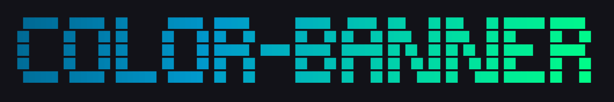 |

| fire | ice | rainbow |
|------|-----|---------|
|  |  |  |

</details>

<details>
<summary><strong>ansi_shadow</strong></summary>

| neon | sunset | ocean |
|------|--------|-------|
|  | 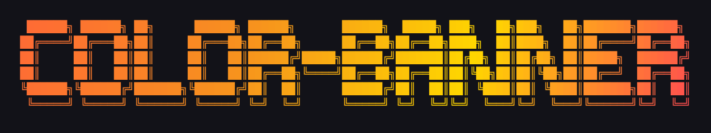 | 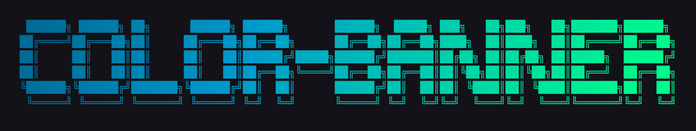 |

| fire | ice | rainbow |
|------|-----|---------|
|  | 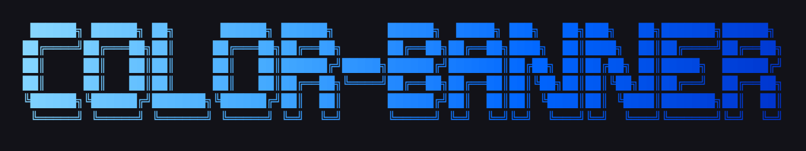 |  |

</details>

<details>
<summary><strong>bigmono12</strong></summary>

| neon | sunset | ocean |
|------|--------|-------|
| 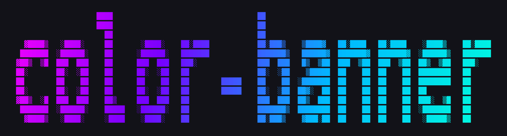 |  |  |

| fire | ice | rainbow |
|------|-----|---------|
| 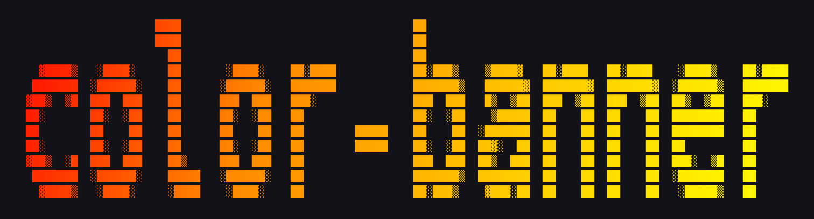 |  | 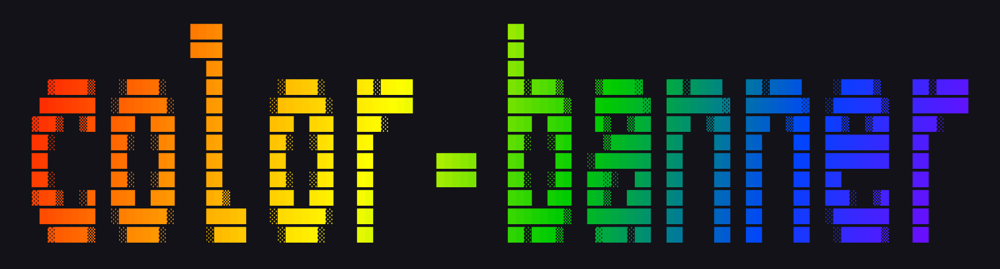 |

</details>

<details>
<summary><strong>bigmono9</strong></summary>

| neon | sunset | ocean |
|------|--------|-------|
|  |  |  |

| fire | ice | rainbow |
|------|-----|---------|
| 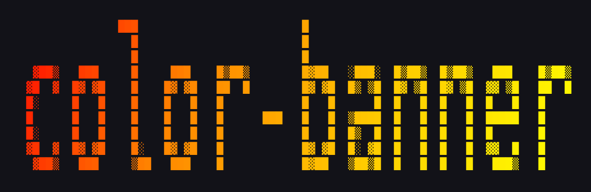 |  | 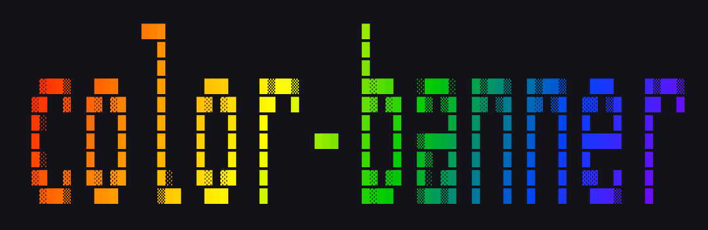 |

</details>

<details>
<summary><strong>bloody</strong></summary>

| neon | sunset | ocean |
|------|--------|-------|
| 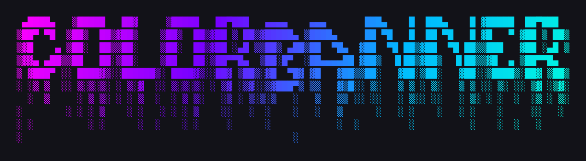 | 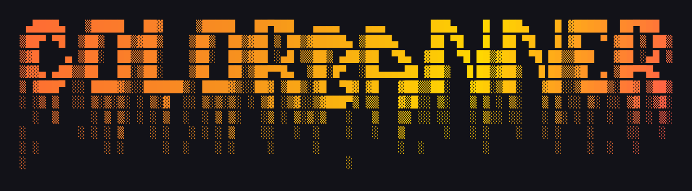 | 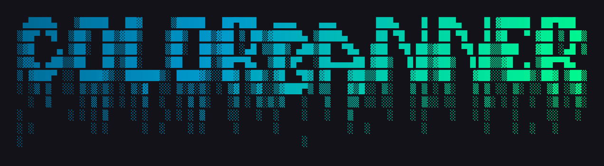 |

| fire | ice | rainbow |
|------|-----|---------|
|  |  |  |

</details>

<details>
<summary><strong>delta_corps_priest_1</strong></summary>

| neon | sunset | ocean |
|------|--------|-------|
|  |  |  |

| fire | ice | rainbow |
|------|-----|---------|
| 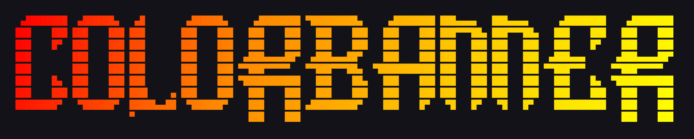 |  | 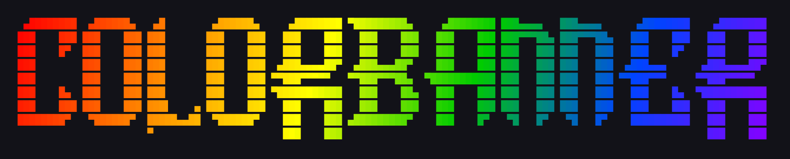 |

</details>

<details>
<summary><strong>dos_rebel</strong></summary>

| neon | sunset | ocean |
|------|--------|-------|
|  |  |  |

| fire | ice | rainbow |
|------|-----|---------|
| 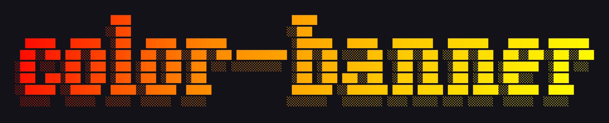 |  | 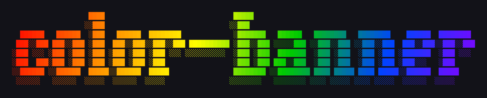 |

</details>

<details>
<summary><strong>double_blocky</strong></summary>

| neon | sunset | ocean |
|------|--------|-------|
|  |  |  |

| fire | ice | rainbow |
|------|-----|---------|
| 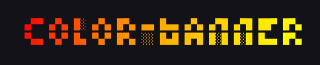 |  |  |

</details>

<details>
<summary><strong>electronic</strong></summary>

| neon | sunset | ocean |
|------|--------|-------|
| 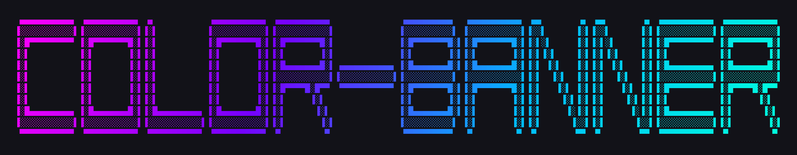 |  |  |

| fire | ice | rainbow |
|------|-----|---------|
|  |  |  |

</details>

<details>
<summary><strong>elite</strong></summary>

| neon | sunset | ocean |
|------|--------|-------|
| 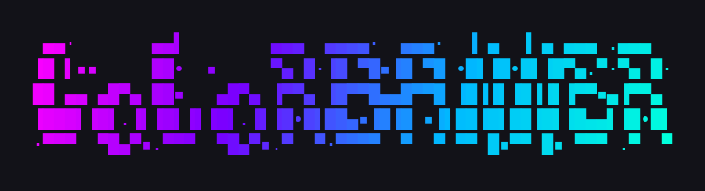 |  |  |

| fire | ice | rainbow |
|------|-----|---------|
|  |  | 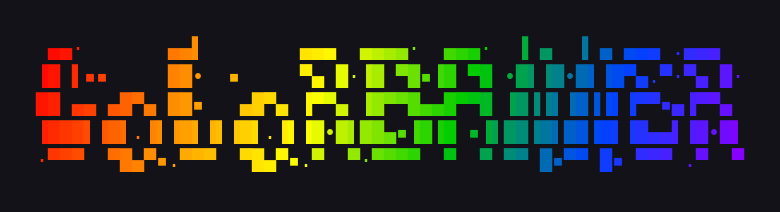 |

</details>

<details>
<summary><strong>future</strong></summary>

| neon | sunset | ocean |
|------|--------|-------|
|  | 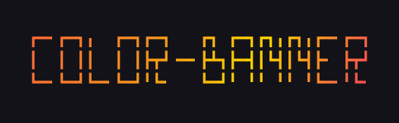 | 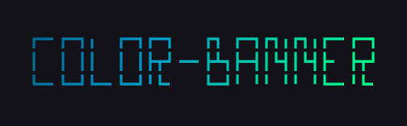 |

| fire | ice | rainbow |
|------|-----|---------|
|  | 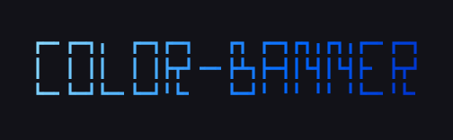 | 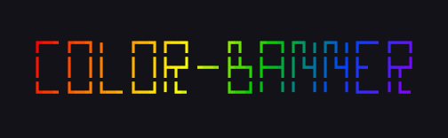 |

</details>

<details>
<summary><strong>mono12</strong></summary>

| neon | sunset | ocean |
|------|--------|-------|
| 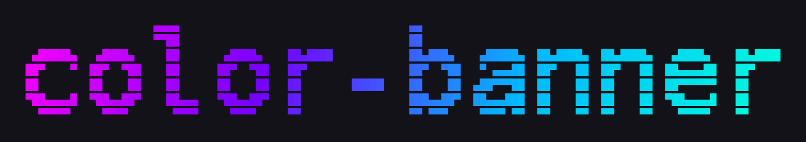 |  | 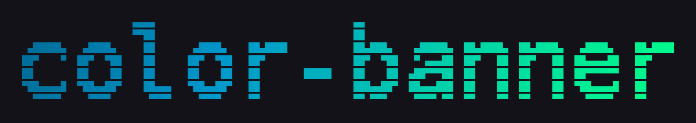 |

| fire | ice | rainbow |
|------|-----|---------|
|  |  |  |

</details>

<details>
<summary><strong>mono9</strong></summary>

| neon | sunset | ocean |
|------|--------|-------|
| 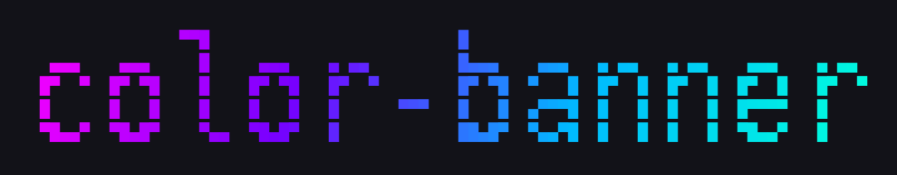 | 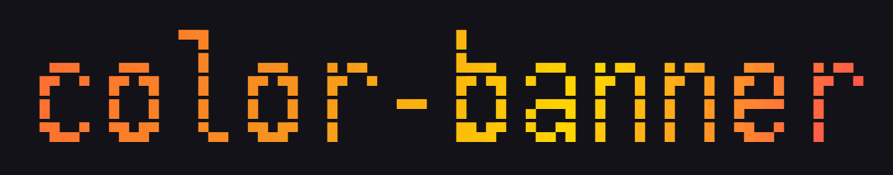 | 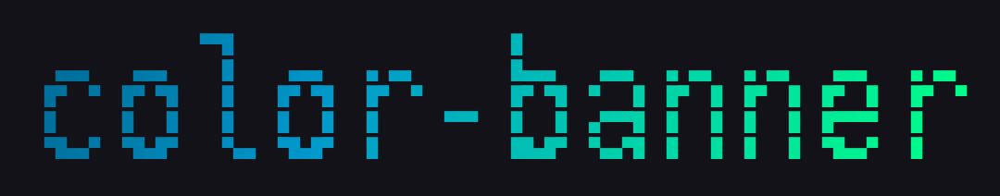 |

| fire | ice | rainbow |
|------|-----|---------|
|  | 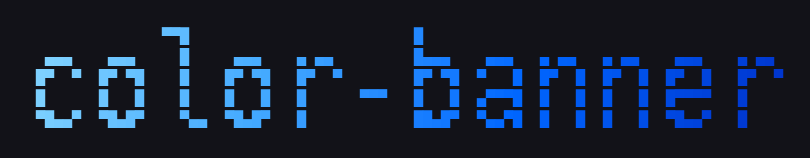 |  |

</details>

<details>
<summary><strong>pagga</strong></summary>

| neon | sunset | ocean |
|------|--------|-------|
| 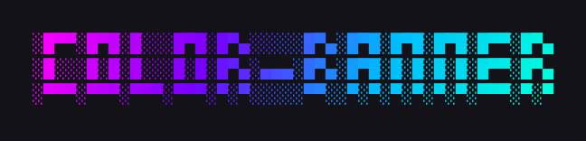 |  |  |

| fire | ice | rainbow |
|------|-----|---------|
| 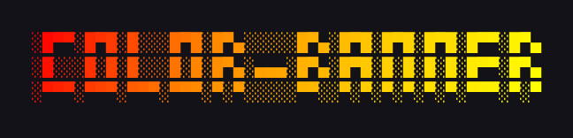 | 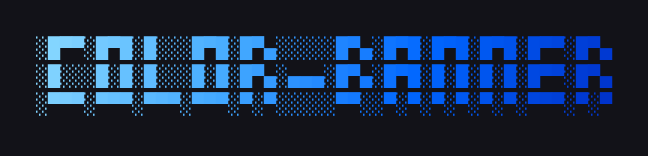 |  |

</details>

<details>
<summary><strong>smmono12</strong></summary>

| neon | sunset | ocean |
|------|--------|-------|
| 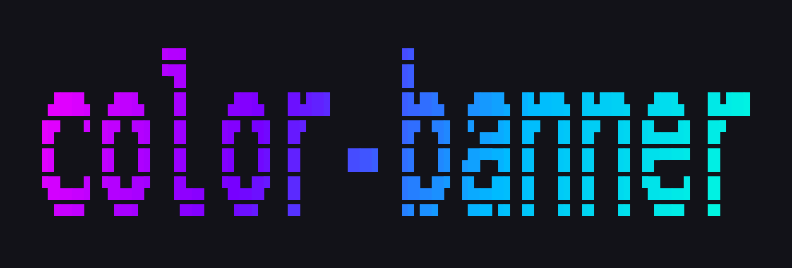 | 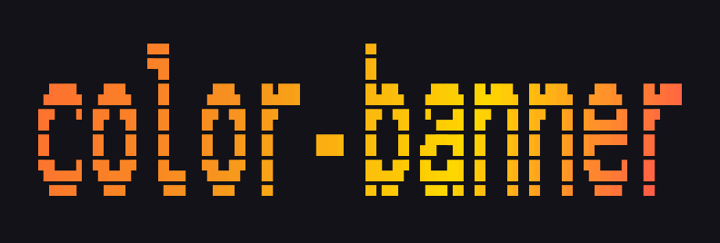 | 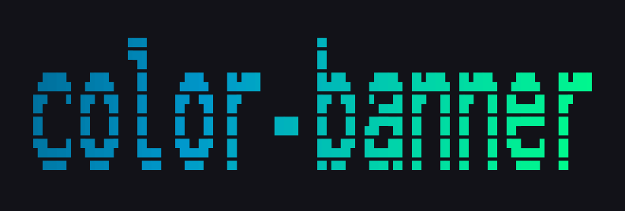 |

| fire | ice | rainbow |
|------|-----|---------|
| 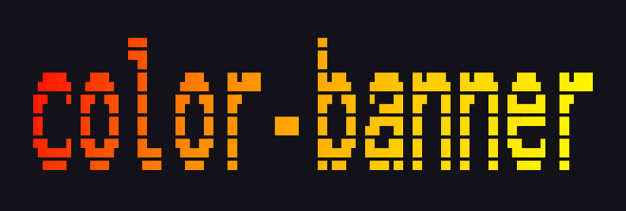 | 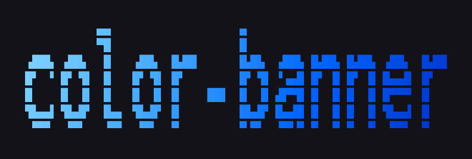 | 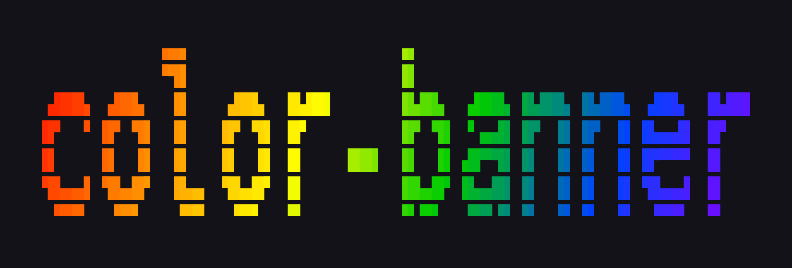 |

</details>

<details>
<summary><strong>smmono9</strong></summary>

| neon | sunset | ocean |
|------|--------|-------|
|  |  | 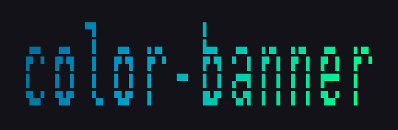 |

| fire | ice | rainbow |
|------|-----|---------|
|  | 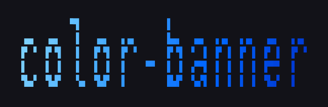 |  |

</details>

<details>
<summary><strong>thick</strong></summary>

| neon | sunset | ocean |
|------|--------|-------|
|  |  |  |

| fire | ice | rainbow |
|------|-----|---------|
| 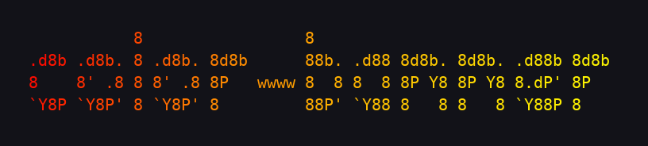 |  |  |

</details>

## License

Apache 2.0 — see [LICENSE](LICENSE), [NOTICE](NOTICE), and [CREDITS.md](CREDITS.md).

## Credits

The rendering engine is [pyfiglet](https://github.com/pwaller/pyfiglet) by Peter Waller,
a pure-Python port of [FIGlet](http://www.figlet.org/) — the original ASCII art renderer
created by Glenn Chappell and Ian Chai in 1991. The 571 bundled fonts and the `.flf` font
format originate from the FIGlet project.

The concept and design are inspired by
[Calligraphy](https://codeberg.org/GeopJr/Calligraphy) by GeopJr,
originally by Gregor "gregorni" Niehl.

See [CREDITS.md](CREDITS.md) for full details and [NOTICE](NOTICE) for the
third-party attribution notices required by Apache 2.0.
